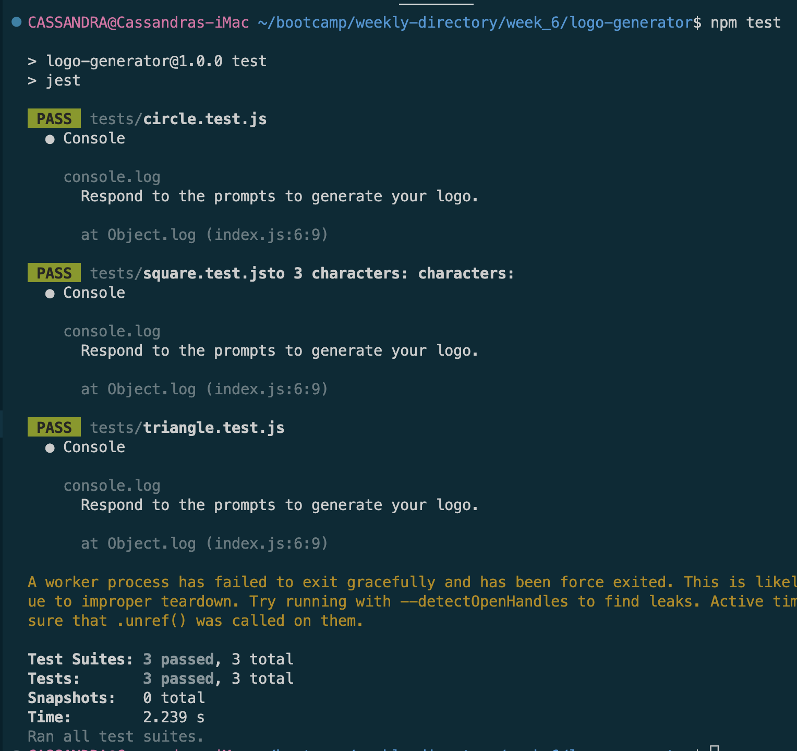
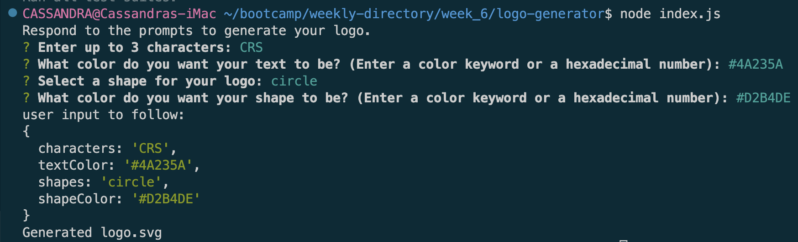
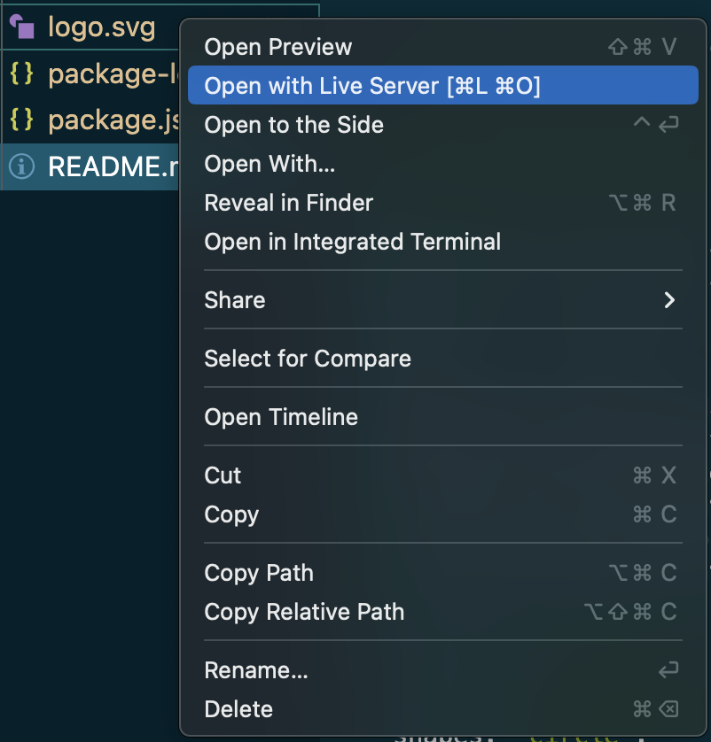
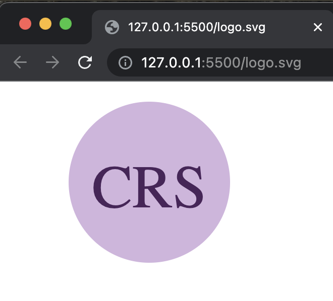

# Logo Generator

## Description

This application generates an SVG logo based on user input.  The user may select up to three characters, a text color, a shape, and a shape color.  When the .svg file generates, it can be loaded in the browser to view.

## Installation

1. Install [Node.js](https://nodejs.org/en).
2. Clone or fork the [repo](https://github.com/scelsic2/logo-generator).
3. Open the repo with VS Code.
4. Open an integrated terminal in the repo folder.
5. In the terminal, run `npm init`.
6. In the terminal, run `npm install inquirer`.  See documentation [here](https://www.npmjs.com/package/inquirer/v/8.2.4).
7. In the terminal, run `npm install jest`.  See documentation [here](https://jestjs.io).
8. In the package.json file, replace the default text next to "test" with "jest" .

## Usage

Run `npm test` in the terminal to run the tests.

Run `node index.js` in the terminal to begin.  Answer each prompt, and you can view your responses in the terminal.

Right click on the logo.svg file that was generated and select "Open with Live Server" to view your logo.

Resulting logo in browser:

A walkthrough video of the Logo Generator can be found [here](https://drive.google.com/file/d/1xblzNc2Ik3MAvmy4X-EdTs9QOSVOP3ST/view?usp=share_link).

## Credits

- https://github.com/SBoudrias/Inquirer.js
- https://www.npmjs.com/package/inquirer-maxlength-input-prompt
- https://github.com/scelsic2/readme-generator/blob/main/index.js
- https://developer.mozilla.org/en-US/docs/Web/SVG/Tutorial/Basic_Shapes
- https://www.youtube.com/watch?v=GJYMcLus3v0&t=25s
- https://www.youtube.com/watch?v=Cgner9r9t5Y
- https://github.com/Jshigoodies/SVG-Logo-Maker
- Tutoring 02APR2023
- Office Hours 02APR2023

## License

MIT License